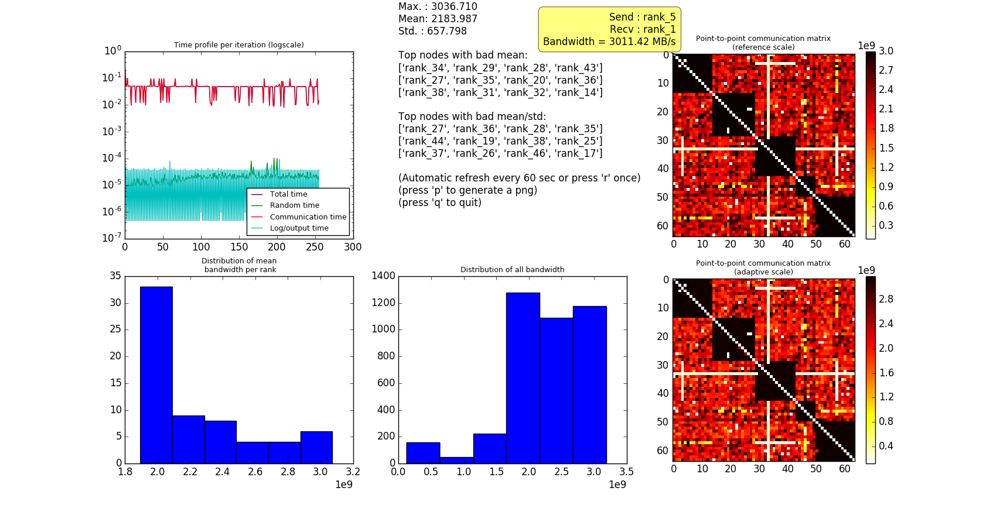

# HP2P

**HP2P** (Heavy Peer To Peer) benchmark is a test which performs MPI Point-to-Point non-blocking communications between all MPI processes. Its goal is to measure the bandwidths and the latencies in a situation where the network is loaded. The benchmark can help to detect problems in a network like contentions or problems with switchs or links.

The benchmark comes with a interactive GUI tool written in Python 2 with Matplotlib for post-processing the result.



[Plotly example](http://htmlpreview.github.io/?https://github.com/cea-hpc/hp2p/blob/master/examples/example.html)

## Prerequisites

Main program:

* C++ compiler
* MPI

Visualization:

* Python 2.x.x
* Python plugins:
 * Numpy
 * Matplotlib
 * mpldatacursor

## Getting started

```
$ ./configure --prefix=<path-to-install>
$ make
$ make install
```
The program **hp2p.exe** is generated.

## Running HP2P

```
$ hp2p.exe -h
 Usage: ./hp2p.exe [-h] [-n nit] [-k freq] [-m nb_msg]
        [-s msg_size] [-o output] [-r hostfile]
        [-b bin_timer] [-i conf_file]
 Options:
    -i conf_file    Configuration file
    -n nit          Number of iterations
    -k freq         Iterations between snapshot
    -s msg_size     Message size
    -m nb_msg       Number of msg per comm
    -b bin_timer    Generate Bin timer (false = 0 (default), true = 1)
    -t max_time     Max duration
    -c build        Algorithm to build couple (random = 0 (default), mirroring shift = 1)
    -r hostfile     Hostfile
    -o output       Output file
```
The program is written in MPI:
```
 $ mpirun -n 32 ./hp2p.exe -n 1000 -s 1024 -m 10 -b 1 -o first_test
```
This command will launch the benchmark on 32 MPI processes and will run 1000 iterations. An iteration consists on a draw of random couples of MPI processes and then a phase where 10 successive communications of 1024 bytes will be performed.
The benchmark aims to test the network, so it is better to launch the benchmark with 1 MPI process per node.
At the end of the execution, a *hostfile.txt* file and files prefixed with *first_test* are created.

## Visualization
### Matplotlib GUI 
```
$ vizhp2p -H hostfile.txt first_test
```
### Plotly HTML
```
$ ./vizhp2p_html -H hostfile.txt -c "Unamed cluster" -o first_test.html first_test.bin
```

## Contributing
## Authors
See the list of [AUTHORS](AUTHORS) who participated in this project.
## Contact

Laurent Nguyen - <laurent.nguyen@cea.fr>

## Website

[CEA-HPC](http://www-hpc.cea.fr/)

## License

Copyright 2010-2017 CEA/DAM/DIF<br />
<br />
HP2P is distributed under the CeCILL-C. See the included files <br />
Licence_CeCILL-C_V1-en.txt (English version) and <br />
Licence_CeCILL-C_V1-fr.txt (French version) or visit  <br />
http://www.cecill.info for details.

## Acknowledgments

The benchmark is similar to the FZ-Juelich [linktest](http://www.fz-juelich.de/ias/jsc/EN/Expertise/Support/Software/LinkTest/_node.html) benchmark.
